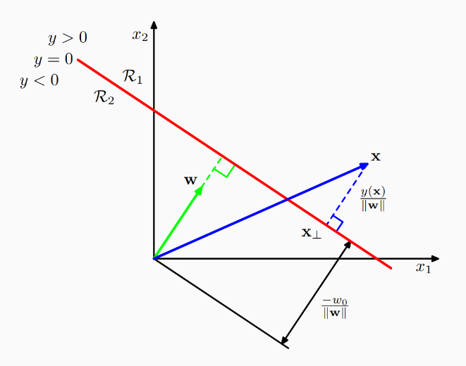
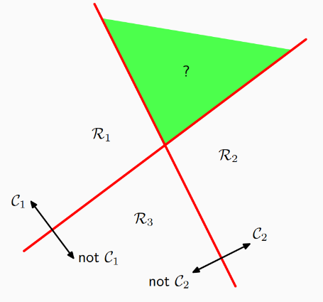
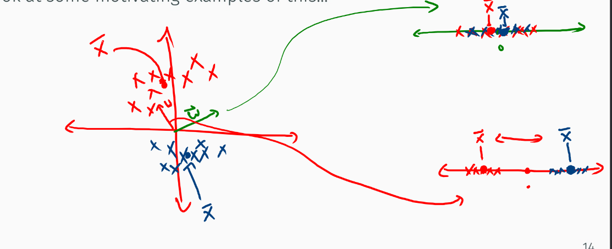

## Linear Model for Classification

Discuteremo una classe di modelli di classificazione chiamati modelli lineari per la classificazione. Il problema della classificazione consiste nel prendere un vettore di input x, e assegnarlo a una delle K classi, dove K è un numero finito. Nella maggior parte degli scenari, tali classi verrano considerate disgiunte, così che un vettore x potrà essere classificato in una e una sola classe.

Considereremo i **modelli di classificazione lineari**, che assumono che la decisione di classificazione possa essere espressa come una combinazione lineare dei pesi e del vettore di input x. Le regioni di decisione sono funzioni lineari di x e sono quindi definite da iperpiani (D'1)-dimensionali, in uno spazio di input D-dimensionale.

### Funzione discriminante lineare

La più semplice rappresenatione di una funzione discriminante lineare è la seguente:

$
\begin{equation}
y(x) = w^T x + w_0
\end{equation}
$

Dove $w$ è il vettore dei pasi e $w_0$ è il bias scalare. Nei problemi di classificazione, il bias negativo è spesso chiamato "threshold" (ovvero soglia). Il threshold è un valore che definisce il punto di separazione: se la probabilità calcolata supera questa soglia, si assegna l'input alla classe positiva; altrimenti, si assegna alla classe negativa.

#### Funzione discriminante per due classi

Il caso con sole due classi disgiunte è il più semplice. Vediamo come possiamo definire la funzione discriminante per due classi.
$
\begin{equation}
class(x) =
\begin{cases}
C_1 & \text{se } \mathbf{w}^\top \mathbf{x}  \geq 0 - w_0\\
C_2 & \text{se } \mathbf{w}^\top \mathbf{x}  < 0 - w_0
\end{cases}
\end{equation}
$

Da questa equazione è evidente come il bias $w_0$ identifichi la soglia che separa le due classi nello spazio.

La distanza normale dall'origine della superficie di descione è data da:

$
\begin{equation}
\frac{\mathbf{w}^t \mathbf{x}}{\|W\|} = -\frac{\mathbf{w_0}}{\mathbf{\|w\|}}
\end{equation}
$

Compattiamo le notazioni per comodità e introduciamo $x_0 = 1$:

$  
\begin{equation}
\tilde{\mathbf{w}} = (\mathbf{w_0}, \mathbf{w})^T
\end{equation}\\
\begin{equation}
\tilde{\mathbf{x}} = (\mathbf{x_0} = 1, \mathbf{x})^T
\end{equation}\\
\begin{equation}
y(x) = \tilde{\mathbf{x}}^T \tilde{\mathbf{x}}
\end{equation}\\
$

#### Più classi

Per estendere il modello a più classi, possiamo utilizzare la strategia **one-vs-rest**. In questo caso, addestreremo K-1 classificatori, ognuno dei quali risolve un problema di classificazione a due classi, separando dalla classe $C_k$ tutti i punti che non vi appartengono.

Con l'aumento delle classi questo approccio non scala bene, in quanto il numero di classificatori cresce insieme al numero di classi.

Possiamo evitare questo problema, usando un singolo discriminante della seguente forma:

$
\begin{equation}
y_k(\mathbf{x}) = \mathbf{w}_k^T \mathbf{x} + \mathbf{w}_{k0}
\end{equation}\\
\begin{equation}
y(\mathbf{x}) = \mathbf{\tilde{W}}^T \mathbf{\tilde{x}}
\end{equation}
$

Assegneremo x alla classe k per cui $y_k(x) \geq y_j(x)$ per ogni j diverso da k.

Dato che la classificazione si basa sul massimo di funzioni lineari, le regioni decisionali sono poliedri convessi, singolarmente connessi.

### Minimi quadrati per la classificazione

Abbiamo visto che per la regressione è possibile misurare l'errore come somma dei quadrati minimi e che quewsto porta a una soluzione soddisfacente.
Proviamo a usare la stessa logica nell'ambito della classificazione.

Ogni classe può essere definita dal proprio modello lineare:

$
\begin{equation}
y_k(\mathbf{x}) = \mathbf{w}_k \mathbf{x} + \mathbf{w}_{k0}
\end{equation}
$

O, in forma compatta:

$
\begin{equation}
y(\mathbf{x}) = \mathbf{\tilde{W}}^T \mathbf{\tilde{x}}
\end{equation}
$

Risolviamo $\mathbf{\tilde{W}}$ minimizzando la somma dei quadrati degli errori. Consideriamo un training set {$\mathbf{x}_n$, $\mathbf{t}_n$} con n = 1, ..., N.
Definiamo una matrice T, dove la riga $\mathbf{n}$-esima è il vettore di target $\mathbf{t}^T_n$.
Definiamo anche la matrice $\mathbf{\tilde{X}}$, dove la riga $\mathbf{n}$-esima è il vettore di input $\mathbf{x}^T_n$.
Scriviamo quindi la funzione di errore:

$
\begin{equation}
E_D(\mathbf{\tilde{W}}) = \frac{1}{2} Tr \{(\mathbf{\tilde{X}}\mathbf{\tilde{W}} - T)^T (\mathbf{\tilde{X}}\mathbf{\tilde{W}} - T)\}
\end{equation}
$

Dove Tr indica la traccia della matrice, ovvero la somma degli elementi sulla diagonale principale.

Se calcoliamo il gradiente di $E_D$ rispetto a $\mathbf{\tilde{W}}$ e lo poniamo uaugale a 0, otteniamo:

$
\begin{equation}
\mathbf{\tilde{W}} = (\mathbf{\tilde{X}}^T \mathbf{\tilde{X}})^{-1} \mathbf{\tilde{X}}^T \mathbf{T}
= \mathbf{\tilde{X}}^{\dagger} \mathbf{T}
\end{equation}
$

Quindi:

$
\begin{equation}
\mathbf{y(x)} =\mathbf{\tilde{W}}^T \mathbf{\tilde{x}}=\mathbf{T}^T (\mathbf{\tilde{X}}^{\dagger} )^T \mathbf{x}
\end{equation}
$

Però i risultati ottenuti con questo classificatore non sono sosddisfacenti.

### Discriminante lineare di Fisher

Possiamo vedere la classificazione lineare per discriminante riducendo a una dimensione la superificie di decisione:

Proviamo a iniziare clacolando la media di ogni classe nello spazio delle feature:

$
\begin{equation}
\mathbf{m}_k = \frac{1}{N_k} \sum_{n=1}^{N_k} \mathbf{x}_{k,n}
\end{equation}
$

Partiamo calcolando la media per k=1 e k=2. Possiamo computare $w$
in modo che, proiettando $m_1$ e $m_2$ su di esso, la distanza tra le proiezioni sia massima:

$
\begin{equation}
w^T m_2 - w^T m_1 = w^T(m_2 - m_1) 
\end{equation}
$

Il problema con questa massimizzazione è che, al crescere della norma di w,
il valore della distanza aumenta indefinitamente. Per ovviare a questo problema,
possiamo vincolare la norma di w a 1 (w normalizzato, affinché abbia lunghezza unitaria).
Applicando questo vincolo otteniamo che: $w$ $\alpha$ $(m_2 - m_1)$.

L'intuizione di Fisher consiste nel cercare di massimizzare la varianza inter-classe e minimizzare
la varianza intra-classe nella proiezione a uni dimensionale.

La varianza inter-classe misura quanto le classi siano distanti tra loro e nello spazio proiettato. Fisher
vuole che i centroidi delle classia sino il più possibile distanti lungo la direzione scelta per la proiezione (lungo $w$).

$
\begin{equation}
 Varianza \ inter-classe= (w^T (m_2 - m_1))^2
\end{equation}
$

La varianza intra-classe misura quanto i punti di una stessa classe siano sparpagliati intorno al loro centroide, lungo la direzione scelta per la proiezione:

$
\begin{equation}
 S^2_k = \sum_{n=1}^{N_k}(\mathbf{w}^T\mathbf{x}_{k,n} - \mathbf{w}^T\mathbf{x}_k)^2
\end{equation}
$

Definiamo quindi il criterio di Fisher nel come il rapporto tra
la varainza inter-classe e la varianza intra-classe:

$
\begin{equation}
J(\mathbf{w}) = \frac{(w^T (m_2 - m_1))^2}{S_1^2 + S_2^2}
\end{equation}
$

Possiamo riscrivere in modo più esplicito:

$
\begin{equation}
J(\mathbf{w}) = \frac{\mathbf{w}^T \mathbf{S}_B \mathbf{w}}{\mathbf{w}^T \mathbf{S}_W \mathbf{w}}
\end{equation}
$

Dove $\mathbf{S}_B$ è la matrice di covarianza tra classi e $\mathbf{S}_W$ è la matrice di covarianza intra-classe.
$J(\mathbf{w})$ è massimizzato quando $(\mathbf{w}^T\mathbf{S}_B \mathbf{w})\mathbf{S}_W \mathbf{w}= (\mathbf{w}^T\mathbf{S}_W \mathbf{w})\mathbf{S}_B \mathbf{w}$
Dato che non ci interessa della scala di $\mathbf{w}$, possiamo togliere i fattori scalari (quelli tra parentesi) e moltiplicare per $\mathbf{S}_W^{-1}$:

$
\begin{equation}
 \mathbf{w} \ \alpha \ \mathbf{S}_W^{-1}(m_2 - m_1)
\end{equation}
$

I risultati con questa tecnica sono molto più soddisfacenti.

#### Relazione con l'approccio least squares

Mentre l'approccio least squares cerca di apprendere delle funzioni lineari che sono più vicine possibili ai targer, il criterio di Fisher
cerca di massimizzar la separazione tra le classi nello spazio discriminante. È possibile mostrare che per un problema a due classi,
il discriminante di Fisher è equivalente a quello di least squares:

$
\begin{equation}
t_n =
\begin{cases}
\frac{N}{N_1} & \text{se } \mathbf{x}_n  \in \mathbf{C}_1\\
-\frac{N}{N_2} & \text{se } \mathbf{x}_n \in \mathbf{C}_2
\end{cases}
\end{equation}
$
