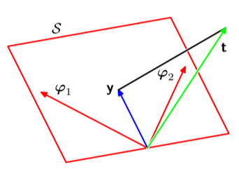

# Regressione Lineare

L'obiettivo della regressione è quello di predirre il valore di uno o più target continui t, dato il valore di un vettore x D-dimensionale di variabili di input. La regressione polinomiale è un esempio specifico di **regressione lineare**: una classe di modelli di regressione che condividono la caratteristica di essere lineari nel rispetto dei parametri. Un sottogruppo di modelli lineari, ancora più semplici, prevede di essere lineare anche rispetto alle variablili di input, ma vedremo che può essere molto limitante. Conviene invece prendere combinazioni lineari di un set fissato di funzioni non lineari. Queste funzioni sono dette funzioni base (**basis functions**).

## Modelli di funzioni base lineari

Il modello linere più semplice possibile per la regressione è quello formato da una combinazione lineare di variabili di input:

$$y(x, w) = {(w_0+w_1x_1+ \dots + w_Dx_D )}$$

Questo modello lineare è tale perché è lineare rispetto ai parametri $w$.
Inoltre risulta lineare anche negli input $x = (x_1, \dots, x_D)^T$, ma questo impone delle limitazioni notevoli. È per questo motivo che estendiamo la classe di modelli di regressione lineare, includendo anche tutti quei modelli che sono combinazione lineare dei parametri $w = (w_1,\dots,w_D)$ e combinazione lineare di un set fissato di funzioni non lineare di $x$. I modelli prendono la seguente forma:

$$y(X,W)=w_0+\sum_{j=1}^{M-1} w_j \phi_j(X) $$

Dove $\phi_j(X)$ sono le funzioni base. Questo modello è lineare rispetto ai parametri $w$,
ma non è lineare rispetto ai parametri $\phi$. Questo modello è chiamato **modello di funzioni base lineari**.
Il massimo valor di j è M-1, quindi il numero totale di parametri del modello sarà M.

Il parametro $w_0$ è chiamato **bias** e permette qualsiasi offset fisso nei dati.

Analiziamo adesso il caso di modello di regressione lineare polinomiale: questo è un caso particolare di regressione lineare, in cui è presenre una sola variabile di input $x$,
e in cui le funzioni di base prendono la forma delle potensze di x $\phi_j(x) = x^j$.
Il più grande problema delle funzioni base polinomiali è sono funzioni globale della variabile di input, ovvero che un cambiamento in una regione di x influisce in tutte le altre regioni.
QUesto può essere risolto dividendo lo spazio degli inpunt, in diverse regioni e per ognuna usare un polinomio diverso, ottentendo così una spline, per esempio:

$$\phi_j(x) = \exp {-(x-\mu_j)^2 \over 2s^2}$$

Queto tipo di funzioni base sono chiamate **Gaussiane**.

## Maximum likelihood e Least Squares

Assumiamo che la variabile di target $t$ sia data da una funzione deterministica $y(X,W)$ con l'aggiunta di
un errore Gaussiano $\epsilon$:

$$t = y(X,W) + \epsilon$$

Dove $\epsilon$ è una variabile casuale con distribuzione Gaussiana con media zero
e varianza $\beta^{-1}$. Possiamo quindi scrivere:

$$p(t|X,W,\beta) = N(t|y(X,W),\beta^{-1})$$

Se consideriamo una squared loss function, allora la predizinoe ottimanle per un nuovo valore di x, sarà data dalla media pesata della variabile di target:

$$E[t|X] = \int t p(t|X) dt = y(X,W)$$

Per via del rumore Gaussiano, la distribuzione condizidizionata di t data x è unimodale,
ovvero presenta un solo picco di massimo, che può risultare limitante per alcune applicazioni.

Addesso consideriamo un set di input $X = {x_1, \dots, x_N}$ e un set di target $T = {t_1, \dots, t_N}$.
Raggruppiam le variabili target in un vettore a colonna e lo chiamiamo $t$.
Assumendo che questi dati sono indipendenti dalla distribuzione, otteniamo la seguente formula per la funzione di likelihood:

$$
p(t|X,W,\beta) = \prod_{n=1}^{N} N(t_n|y(x_n,W),\beta\begin{cases}
C_1 & \text{se } \mathbf{w}^\top \mathbf{x} - w_0 \geq 0 \\
C_2 & \text{se } \mathbf{w}^\top \mathbf{x} - w_0 < 0
\end{cases}^{-1})
$$

Questa è una funzione dei parametri $W$ e $\beta$. Applicando il logaritmo, ricavaviamo:

$$ln p(t|X,W,\beta) = \sum_{n=1}^N ln N(t_n|y(x_n,W),\beta^{-1})$$

$$= -{N \over 2} ln \beta - {N \over 2} ln(2\pi) - \beta E_D(W)$$

Dove $E_D(W)$ è la somma degli errori al quadrato:

$$E_D(W) = {1 \over 2} \sum_{n=1}^N \{ t_n - W^T \phi(X_n) \}^2$$

Dato che abbiamo scritto la funzione di likelihood, possiamo massimizzarla per determinare $w$ e $\beta$.
Massimizziamola nel rispetto di $w$. Grazie alla fomra logaritmica della funzione di likelihood
è evidente che massimizzare enl rispetto di $W$, significa massimizzare la somma dei quadrati degli errori $E_D(W)$:

$$
\nabla ln {p(t|W, \beta)} = \sum_{n=1}^N \{ t_n - W^T \phi(X_n) \} \phi(X_n)
$$

Impostanto il gradiente a 0 risolvendo nel rispetto di $W$, otteniamo la seguente equazione:

$$W_{ML} = (\Phi^T \Phi)^{-1} \Phi^T t$$

Detta **equazione normale**. Dove $\Phi$ è la matrice di dimensioni $N \times M$ e i cui elementi
sono dati da $\Phi_{nj} = \phi_j(x_n)$.

$$\Phi = \begin{bmatrix} \phi_0(x_1) & \phi_1(x_1) & \dots & \phi_{M-1}(x_1) \\ \phi_0(x_2) & \phi_1(x_2) & \dots & \phi_{M-1}(x_2) \\ \vdots & \vdots & \ddots & \vdots \\ \phi_0(x_N) & \phi_1(x_N) & \dots & \phi_{M-1}(x_N) \end{bmatrix}$$

### Bias

Ripendiamo la formula ricavata per $E_D(W)$ e esplicitiamo il bias ($w_0):

$$E_D(W) = {1 \over 2} \sum_{n=1}^N \{ t_n - w_0 -   \sum_{j=1}^{M-1}w_j\phi_j(X_n) \}^2$$

Derivando rispetto a $w_0$ e uguagliando a zero, otteniamo il seguente risultato:

$$w_0 = {1\over N}\sum_{n=1}^N t_n - \sum_{j=1}^{M-1}w_j {1\over N}\sum_{n=1}^{N}\phi_j (X_n) = \bar{t} - \sum_{j=1}^{M-1} w_j \bar{\phi_j}$$

Quindi il bias $w_0$ **compensa la differenza tra la medie dei valori target e la somma pesata delle medie delle funzioni di base**.

## Intepretazione geometrica dei minimi quadrati

Consideriamo uno spazio N-dimensinale i cui assi sono dati da $t_n$, così che il vettore target $t$
è un vettore in tale spazio. Ongi funzione base $\phi_j(x)$ valorizzata negli N punti, può anch'essa essere visata
come un vbettore nello stesso spazio, chiamato $\alpha_j$.

$\alpha_j$ corrisponde alla $j-$esima colonna della mapatrice $\Phi$.
Se M < N, allora il vettore i vettori $\phi_j(X_n)$, formeranno un sottospazio lineare $S$
di dimensione M all'interno dello spazio N-dimensionale. Dato che y è una combinazione lineare arbitraria
dei vettori $\alpha_j$, il vettore y giacerà nello spazio S. Il vettore target t giacerà in uno spazio N-dimensionale

Ripendiamo adesso la formula della somma dei quadrati degli errori:

$$E_D(W) = {1 \over 2} \sum_{n=1}^N \{ t_n - W^T \phi(X_n) \}^2$$

Questa formula diventa uguale a:

$$E_D(W) = {1 \over 2} || t - \Phi W ||^2$$

ovvero la distanza Euclidea tra il vettore y e t (a meno di $1 \over 2$).
Dato che y giace su S, la soluzione di minimo quadrato è data dalla proiezione ortogonale di t su S.
Questa cosa è verificabile, notando che la soluzone per y è data da $\Phi W_ML$,
dove $W_ML$ è il vettore dei pesi che ottimizza i minimi quadrati.

Potrebbero sorgere delle difficoltà numeriche: se la matriche $\Phi^T \Phi$ è quasi singolare (determinante vicno a zero).
Questo accade quando due vettori o più, tra i vetotir base $\alpha_j$ sono quasi collineari. Questo può portare a parametri risultanti molto molto grandi.

## Sequential Learning

Il problema della tecnica del maximum likelihood è che richiede di processare tutto il seti di addestramento
in un una sola volta. Con UN set molto grande questo inizia a esse oneroso. Se i il set è sufficientemente
grande può convenire addestrare il modello sequenzialmente, ovvero aggiungendo un dato alla volta
(one-line algotihm), in modo da aggiornare i parametri del modello a ogni presentazione dal dataset.
Questo approccio è l'ideale anche per applicaizoni in real time, in cui i dati arrivano costantemente.
Per applicare questo approccio, possiamo usare la tecnica conosciuta come seque4ntial gradient descent.
Se la funzione di errore, consiste nella somma degli errori dei singoli punti, allora dopo la presentazione del pattern n
l'algoritmo del gradiente sequenziale, aggiornerà il vettore dei parametri $W$ come seque:

$$W^{(\tau+1)} = W^{(\tau)} + \eta \nabla E_n(W)$$

dove $\tau$ indica in numero dell'interazione, $\eta$ è il learning rate e $\nabla E_n(W)$ è il gradiente dell'errore.
della singola presentazione n.
Per il caso della somma degli errori al quadrato, abbiamo:

$$w^{(\tau+1)} = w^{(\tau)} + \eta (t_n - w^{(\tau)^T} \phi(X_n)) \phi(X_n)$$

Questa formual è nota col nome di leas-mean square (LMS) algorithm.

## Regualrized Least Squares

Andiamo a aggiungere un termine di regolarizzazione alla funzione di errore per evitare overfitting.
La funzione di errore da minimizzare diventa:

$$E_D(W) + \lambda E_W(W)$$

dove $\lambda$ è il coefficiente di regolarizzazione che controlla l'importanza dell'errore
dipendente dai dati $E_D(W)$ e il temine di regolarizzazione $E_W(W)$.

Il modo più comune di regolarizzare è quello di usare un regolarizzatore dato dalla somma dei
quadrati dei pesi:

$$E_W(W) = {1 \over 2} W^T W$$

Consideriamo la funzione di errore come somma dei quadrati degli errori $E_D(W) = {1 \over 2} \sum_{n=1}^N \{ t_n - W^T \phi(X_n) \}^2$. Otteniamo:

$${1 \over 2} \sum_{n=1}^N \{ t_n - W^T \phi(X_n) \}^2 + {1 \over 2} \lambda W^T W$$

Questa forma di regolarizzatore è detta **weight decay**, perché negli algoritmi di apprendimento sequenziale
fa tendere i pesi dei valori a zero, a meno che non siano supportati dai dati.

Il vantaggio di questo tipo di regolarizzatore è che la funzione di errore rimane
quadratica rispetto ai pesi, quindi la minimizzaizone avviene nello stesso modo.
Calcoliamo quindi il gradiente della funzione di errore regolarizzata:

$$\nabla E(W) = \sum_{n=1}^N \{ t_n - W^T \phi(X_n) \} \phi(X_n) + \lambda W$$

Uguagliando a zero il gradiente, otteniamo la seguente equazione:

$$W = (\lambda I + \Phi^T \Phi)^{-1} \Phi^T t$$

Ricordiamo a cosa è uguale $\Phi$:

$$\Phi = \begin{bmatrix} \phi_0(x_1) & \phi_1(x_1) & \dots & \phi_{M-1}(x_1) \\ \phi_0(x_2) & \phi_1(x_2) & \dots & \phi_{M-1}(x_2) \\ \vdots & \vdots & \ddots & \vdots \\ \phi_0(x_N) & \phi_1(x_N) & \dots & \phi_{M-1}(x_N) \end{bmatrix}$$

Possiamo generalizzare la formula del regolarizzatore ponendo l'esponente
uguale a q:

$${1 \over 2} \sum_{n=1}^N \{ t_n - W^T \phi(X_n) \}^2 + {\lambda \over 2}  \sum_{j=1}^M |w_j|^q$$

q=2 corrisponde al regolarizzatore visto fino ad ora.

## Output multipli

Fino ad ora abbiamo considerato il caso di un solo target. Possiamo estendere il modello
in modo da predirre contemporaneaeente K>1 target diversi, raggruppati in un vettore target t.
È possibile ottenere questo risultato introducendo un set di funzioni base differente per ogni
target, ottentendo problemi di regressione tra loro indipendenti.
Un approccio più comune è quello di usare un singolo set di funzioni base per modellare
tutti i termini del vettore target. Definiamo:

$$y(X,W) = W^T \phi(X)$$

dove y è K-dimensionale e W è M x K (matrice di parametri), mentre $\phi(X)$ è M-dimensionale.

Supponiamo di prendere una distribuzione condizionata Gaussiana per i target:

$$p(t|X,W,\beta) =  N(t|W^T \phi(X), \beta^{-1} I)$$

Se abbiamo un set di osservazioni $t_1, \dots, t_N$, possiamo creare una matrice T N x K
in modo che la riga n-esima contenga il target per l'osservazione n-esima $t_n^T$. In modo analogo
creaiamo a matrice X. Quindi la forma logaritmica della funzione di likelihood diventa:

$$ln p(T|X,W,\beta) =  \sum_{n=1}^N ln N(t_n|W^T \phi(X_n), \beta^{-1} I)$$

che è uguale a:

$${NK \over 2} ln ({\beta \over 2\pi}) - {\beta \over 2} \sum_{n=1}^N ||t_n - W^T \phi(X_n)||^2$$

## Decomposizione bias-varianza

Fino ad ora abbiamo assunto che il numero di funzioni di base a la loro forma siano caratteristiche
fissate. Il problema di queste semplificazioni è la sopraggiunta di overfitting nel caso in cui un modello
complesso venga addestrato su dataset limitati. Abbiamo visto come la regolarizzazione possa
aiutare con il problema di overfitting nel caso di modelli con molti parametri, ma introduce una nuova
domanda: Che $\lambda$ dobbiamo scegliere? Questo problema è noto come **bias-variance tradeoff**.

Ogni funzione di loss conduce a una certa predizione ottimale, una volta data la distribuzione condizionata
$p(t|X)$. Una scelta comune è quella della funzione di loss quadratica, per la quale
la predizione ottimale è uguale alla expectetion condizionata:

$$h(x) = E[t|X] = \int t p(t|X) dt$$

Possiamo scrivere la funzione di loss quadratica in questo modo (dimostrazione sul libro, pagina 66 del pdf):

$$
E[L] = \int \{ y(X) - h(X) \}^2 p(X)dX
$$

$$
+ \int \{ h(X) - t \}^2 p(X, t)dXdt
$$

Dove il secondo termine è indipendente da y(X). IL primo termine rappresenta l'errore dovuto
alla discrepanza tra y(x) e la funzione ottimale h(x), mentre il secondo è un rumore intrineco nei
dati.
Dato che non possiamo agire sul rumore, il nostro obiettivo è far tendere a zero il primo termine,
quindi trovare una funzione y(x) il più possibile simile a h(x).
Idealmente, con un set infinito di dati, la funzione y(x) sarà uguale a h(x), ma questo non è possibile.

Supponiamo di avere un grande numero di data set, ognuno di dimensione N. Ogni dataset
descrive in modo indipendente la distribuzione condizionata p(t|X). Per ogni dataset $D$ possiamo
eseguire il nostro algoritmo di apprendimento indipendentemente dagli altri, per ottenre la
funzione di predizione $y(X; D)$. Possiamo valotare la performance di un particolare algoritmo di
predizione, andando a fare una media di tutti i risultati ottenuti.
Riprendiamo la funzione di loss quadratica. Il primo termine integrando applicato a un determinato
dataset D diventa:

$$\{ y(X; D) - h(X) \}^2$$

Tale quantità dipende da D, quindi possiamo prendere la media su tutti i dataset. Svolgiamo i seguenti calcoli:

$$\{ y(X; D) - E_D[y(X; D)] + E_D[y(X; D)] - h(X) \}^2$$

$$ = \{ y(X; D) - E_D[y(X; D)] \}^2 + \{ E_D[y(X; D)] - h(X) \}^2 $$

$$- 2\{ y(X; D) - E_D[y(X; D)] \} \{ E_D[y(X; D)] - h(X) \} $$

Possiamo ora prendere l'expectation di questa espressione, rispetto a D e possiamo notare che
L'ultimo termine scopare, lasciando:

$$E_D[\{y(X;D)-h(X)\}^2]$$
$$ = \{E_D[y(X; D)] - h(X)\}^2 + E_D[\{y(X; D) - E_D[y(X;D)]\}^2]$$

Dove il primo termine è il bias al quadrato, mentre il seocndo è la varianza.
Abbiamo quindi espresso il quadrato della differenza tra y(X) e h(X) come la somma del bias al
quadrato e e della varianza. Il bias rappresenza la quantità di cui la nostra predizione media
differisce dalla regressione desiderata. La varianza misura la quantità di cui la soluzione
del dataset singolo può variare intorno alla media.
Mettendo tutto insieme, abbiamo che l'expected loss = bias^2 + variance + noise, dove:

- bias^2 = $\int \{E_D[y(X;D) - h(X)]\}^2 p(X) dx $
- varianza = $\int E_D[\{ y(X;D) - E_D[y(X;D)] \}^2] p(X) dx $
- noise = $\int \{h(X) - t\}^2 p(X, t) dx $

Noi vogliamo minimizzare l'expected loss. er farlo possiamo agire solo su bias e varianza,
i cui valori sono legati. UN modello con basso bias e alta varianza sarà molto flessibile, mentre
un modello con alto bias e bassa varianza sarà relativamente rigido.
I loro valori dipendono dal coefficiente $\lambda$ di regolarizzazione. Un valore basso di $\lambda$
porta a un bias alto e a una bassa varianza, viceversa per un coefficientte più alto.
(vedfi pagina 170-171 del pdf del libro).

## Regressione lineare Bayesiana

### Definizioni

- **distribuzione a priori**: Nell'ambito dell'inferenza statistica bayesiana, una distribuzione di probabilità a priori,
  detta spesso anche distribuzione a priori, di una quantità incognita p (per esempio, supponiamo
  p essere la proporzione di votanti che voteranno per il politico Rossi in un'elezione futura)
  è la distribuzione di probabilità che esprimerebbe l'incertezza di p prima che i "dati"
  (per esempio, un sondaggio di opinione) siano presi in considerazione. Il proposito è di attribuire
  incertezza piuttosto che casualità a una quantità incerta.
- **distribuzione a posteriori**: la distribuzione di una quantità incognita, trattata come
  una variabile casuale, condizionata sull'informazione posta in evidenza da un esperimento o da
  un processo di raccolta di informazione rilevanti (es. un'ispezione, un'indagine conoscitiva, ecc.).

- **distribuzione a priori coniugata**: Nell'ambito della teoria della probabilità bayesiana,
  se le distribuzioni a posteriori p(θ|x) sono nella stessa famiglia della distribuzione a priori
  p(θ), le due distribuzioni sono definite coniugate, e la distribuzione a priori è chiamata
  distribuzione a priori coniugata per la verosimiglianza.

### Distribuzione dei parametri

Iniziamo dfefinendo la distribuzione di probabilità a priori del vettore di parametri di modello $W$.
Riprendiamo la formula di $p(t|W)$ in cui consideriamo parametro di precisione del rumore $\beta$ come
costante:

$$p(t|X,W,\beta) = \prod_{n=1}^N N(t_n|W^T \phi(X_n), \beta^{-1})$$

La corrispondente distribuzione a priori **coniugata** è quindi una Gaussiana della forma:

$$p(W) = N(W|m_0, S_0)$$

dove $m_0$ è il valore medio e $S_0$ è la covarianza.

Possiamo quindi ricavare la distribuzione a posteriori $p(W|t)$ che, avendo scelto una distribuzione a priori coniugatra
della famiglia delle Gaussiane, sarà anch'essa una Gaussiana:

$$p(W|t) = N(W|m_N, S_N)$$

(vedere lo specchietto a pagina 113 del pdf del libro).
Nella formula sopra riportata abbiamo che:

- $m_N = S_N(S_0^{-1}m_0 + \beta \Phi^T t)$
- $S_N^{-1} = S_0^{-1} + \beta \Phi^T \Phi$

Ricoridamo che, per il teorema di Bayes: $p(W|t) \alpha  {p(t|W)p(W)}$, dove $p(W)$
p la distribuzione a priori e $p(t|W)$ è la probabilià di ottenere un vettore target t,
avendo un vettore di pesi $W$ (verosimiglianza).

Essendo La distribuzione a posteriori una Gaussiana, la moda (ovvero il valore piò probabile di $W$) coiuncide con la media
$m_N$. Quindi la stima a posteriosi massima (MAP) è data da $W_{MAP} = m_N$.

Se consideriamo una covarianza molto ampia ($S_0 = \alpha^{-1}I$ con $\alpha \to 0$),
allora la distribuzione a posteriori non sarà influenzato dalla distribuzione a priori e la sua media
(e quindi la sua moda) sarò molto vicna alla massima verosimiglianza $W_ML = (\Phi^T \Phi)^{-1} \Phi^T t$.

Consideriamo per semplicità la forma particolare di distribuzione Gaussiana a **media zero**, governata
da un singolo parametro $\alpha$:

$$p(W|\alpha) = N(W|0, \alpha^{-1}I)$$

e la distribuzione a posteriori corrispondente con i relativi:

- $m_N = \beta S_N \Phi^T t$
- $S_N^{-1} = \alpha I + \beta \Phi^T \Phi$

Scriviamo anche la forma logaritmica della distribuzione a posteriori:

$$
ln p(W|t) = -(\beta /2)\sum_{n=1}^N \{ t_n - W^T \phi(X_n) \}^2
- (\alpha /2) W^T W + const
$$

La massimizzazione di questa distribuzione a posteriori, rispetto a $W$,
corrisponde alla minimizzazione della domma dei quadrati degli errori con un termine di regolarizzazione
in cui $\lambda = \alpha / \beta$.

### Predizione

Nella pratica, la nomstra attenzione ricade maggiormente sulla predizione di t, per ottene nuovi vlaori di x.
Per fare questo, dobbiamo valorizzare la distribuzione predittiva:

$$p(t|X,T,\alpha,\beta) = \int p(t|X,W,\beta) p(W|T,\alpha,\beta) dW$$

dove $T$ è il vettore target provenient3e dal training set.
All'interno dell'integrale ritroviamo la distribuzixone condizionata $p(t|X,X,\beta)$ e la
distribuzione a posteriori dei pesi $p(W|T,\alpha,\beta)$. Quindi la distribuzione predittiva
comprende la convoluzione di due distribuzione Gaussiane, quindi possiamo usare il risultato ottenuto
a pagina 112 del pdf del libro:

$$
p(t|X,T,\alpha,\beta) = N(t|m_N^{T}\phi(X), \sigma_N^2(X))
$$

dove la varianza $\sigma_N^2(X)$ è data da:

$$
\sigma_N^2(X) = {1 \over \beta} + \phi(X)^T S_N \phi(X)
$$

Il termine ${1 \over \beta}$ rappresenta il rumore sul dato, mentre il termine $\phi(X)^T S_N \phi(X)$
rappresenta l'incertezza associata ai parametri $W$. Poiché il rumore e la distribuzione di $W$
sono due quatità Gaussiane indipendenti, la loro varianza è additiva.
Da notare che, non appena un nuovo dato è osservato, la distribuzione a posteriori diventa più stretta,
quindi con una varianza minore ($\sigma_{N+1}^2(X) <= \sigma_N^2(X)$).
Questo comporta che, per $N \to \infty$, il seocndo termine tende a 0 e la varianza della
distribuzione predittiva p governata solo dal rumore gaussiano e quindi dal parametro $\beta$.
